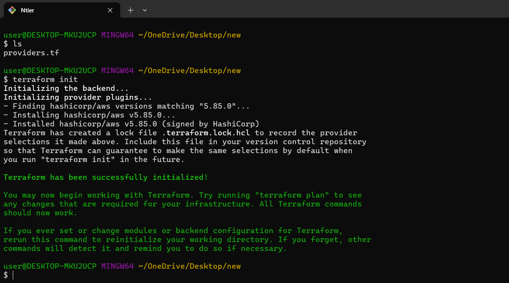
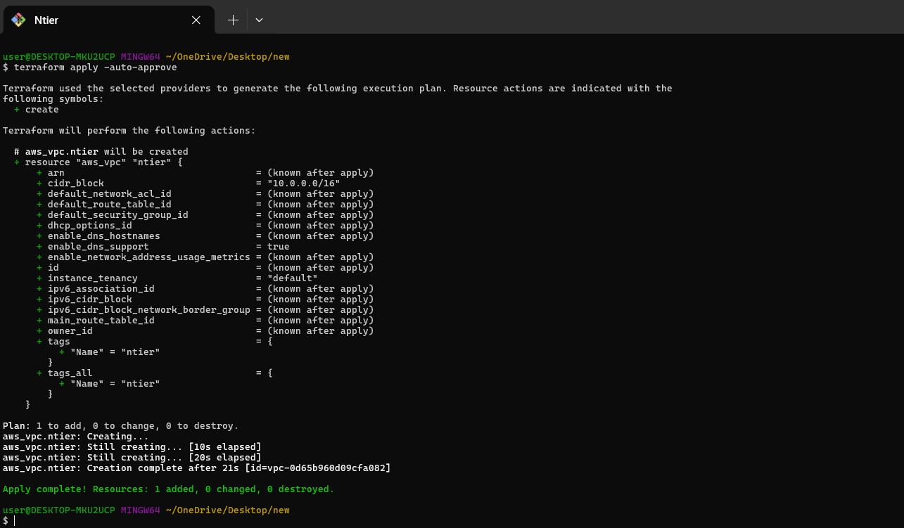
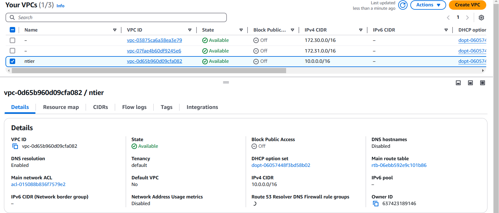
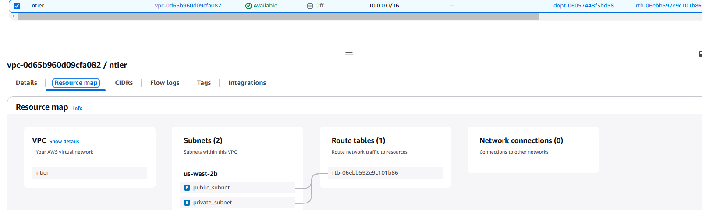
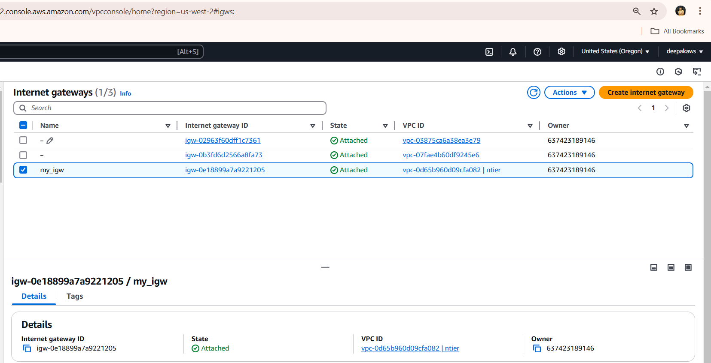
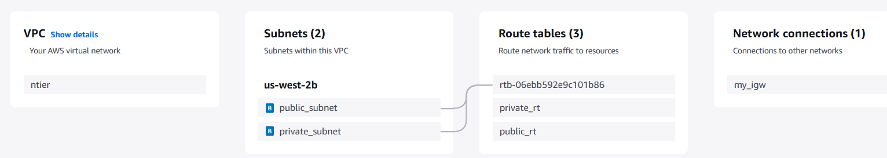
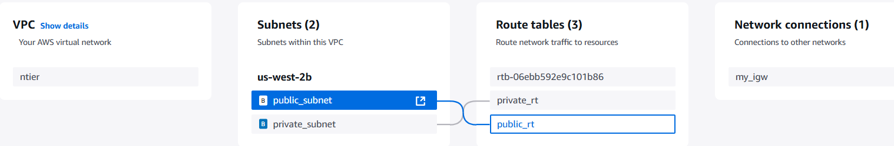

# Custom VPC Setup with Terraform

## Overview
This project creates a custom AWS VPC with the following components:
- A VPC with a specified CIDR block
- Public and private subnets
- An Internet Gateway
- Public and private route tables
- Route table associations
- Routing configuration to enable internet access for public subnet

## Prerequisites
Ensure you have:
- Terraform installed
- AWS CLI configured with appropriate credentials
- An AWS account

## Steps to Execute

Here is providers block

```hcl
terraform {
  required_providers {
    aws = {
      source  = "hashicorp/aws"
      version = "5.85.0"
    }
  }
}

provider "aws" {
  region = "us-west-2"
}
```

### 1. Initialize Terraform
```sh
terraform init
```
This command initializes the Terraform working directory by downloading necessary provider plugins.



### 2. Create the VPC
```hcl
resource "aws_vpc" "ntier" {
  cidr_block = "10.0.0.0/16"
  tags = {
    Name = "ntier"
  }
}
```
**Expected Outcome:** A new VPC with CIDR block `10.0.0.0/16` is created.



### 3. Create Public and Private Subnets
```hcl
resource "aws_subnet" "public_sn" {
  cidr_block = "10.0.0.0/24"
  vpc_id     = aws_vpc.ntier.id
  tags = {
    Name = "public_subnet"
  }
}

resource "aws_subnet" "private_sn" {
  cidr_block = "10.0.1.0/24"
  vpc_id     = aws_vpc.ntier.id
  tags = {
    Name = "private_subnet"
  }
}
```
**Expected Outcome:** Two subnets are created within the VPC.




### 4. Create an Internet Gateway
```hcl
resource "aws_internet_gateway" "my_igw" {
  vpc_id = aws_vpc.ntier.id
  tags = {
    Name = "my_igw"
  }
}
```
**Expected Outcome:** An Internet Gateway is created and associated with the VPC.



### 5. Create Public and Private Route Tables
```hcl
resource "aws_route_table" "public_rt" {
  vpc_id = aws_vpc.ntier.id
  tags = {
    Name = "public_rt"
  }
}

resource "aws_route_table" "private_rt" {
  vpc_id = aws_vpc.ntier.id
  tags = {
    Name = "private_rt"
  }
}
```
**Expected Outcome:** Two route tables are created: one for public and one for private subnet traffic.



### 6. Associate Route Tables with Subnets
```hcl
resource "aws_route_table_association" "public_association" {
  subnet_id      = aws_subnet.public_sn.id
  route_table_id = aws_route_table.public_rt.id
}

resource "aws_route_table_association" "private_association" {
  subnet_id      = aws_subnet.private_sn.id
  route_table_id = aws_route_table.private_rt.id
}
```
**Expected Outcome:** The subnets are associated with their respective route tables.



### 7. Configure Routing for Internet Access
```hcl
resource "aws_route" "igw_associate" {
  route_table_id = aws_route_table.public_rt.id
  gateway_id = aws_internet_gateway.my_igw.id
  destination_cidr_block = "0.0.0.0/0"
}
```
**Expected Outcome:** The public route table is configured to send traffic to the internet via the Internet Gateway.



### 8. Apply the Terraform Configuration
```sh
terraform apply -auto-approve
```
This command provisions all defined AWS resources.

## Cleanup
To remove all resources created by this project, use:
```sh
terraform destroy -auto-approve
```

## Conclusion
This Terraform script sets up a VPC with a public and private subnet, internet connectivity, and route table associations. You can use this setup as a foundation for deploying cloud-based applications.

---
